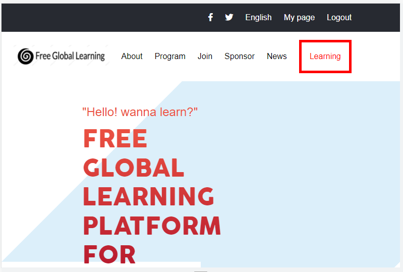
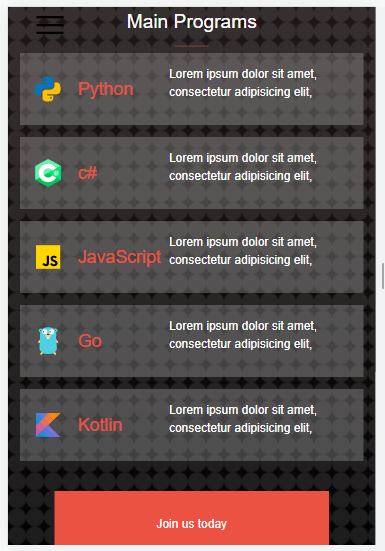

# E-learning-platform

> This is a E-learning-platform website for the FIRST CAPSTONE PROJECT of the microverse program

> We are building the home and the about pages of the first capstone project for both mobile and desktop versions.

## Screen shots

- 
- 

## Built With

- 
- 
- 
- 

## Live Demo (if available)

[Live Demo Link](https://terbeche.github.io/E-learning-platform/)

## Authors

👤 **Terbeche Mostefa**

- GitHub: [@githubhandle](https://github.com/Terbeche)
- LinkedIn: [LinkedIn](https://www.linkedin.com/in/mustapha-terbeche/)

## 🤝 Contributing

Contributions, issues, and feature requests are welcome!

Feel free to check the [issues page](https://github.com/Terbeche/Project-1-Setup-and-mobile-version-skeleton/issues/5).

## Show your support

Give a ⭐️ if you like this project!

## Acknowledgments

- Original design idea by [Cindy Shin in Behance](https://www.behance.net/gallery/29845175/CC-Global-Summit-2015)
  Icons by [icon8](https://icons8.com/)

## 📝 License

This project is [MIT](./MIT.md) licensed.
